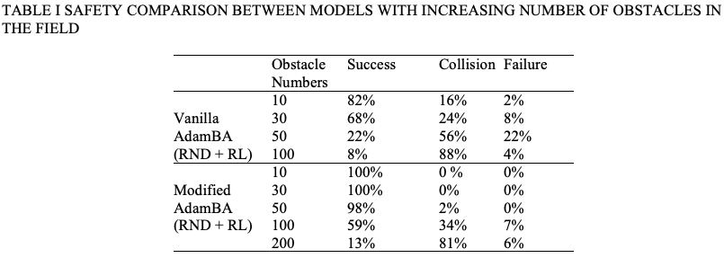
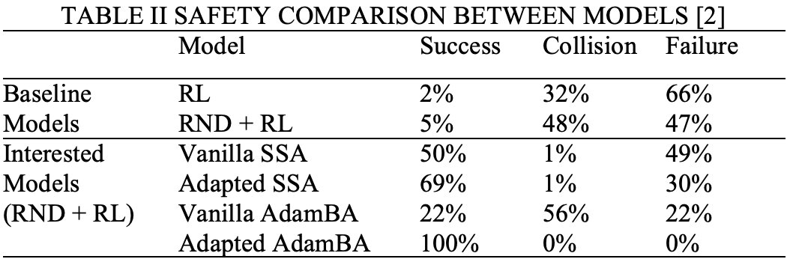
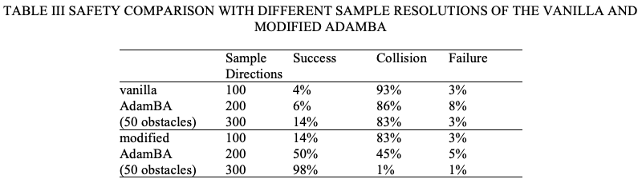
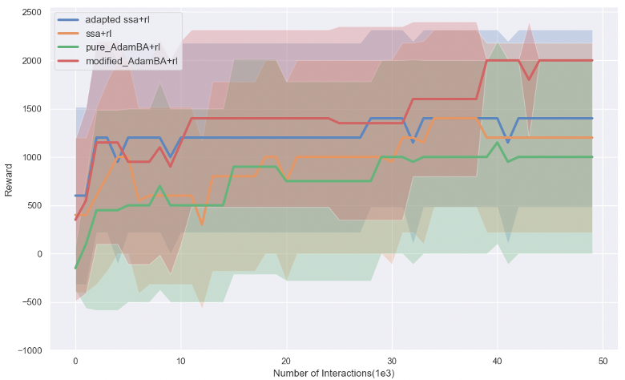
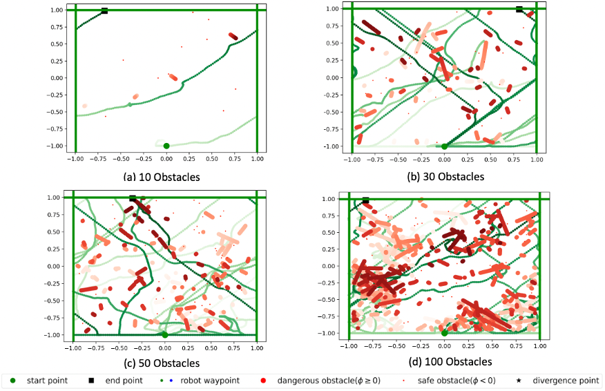
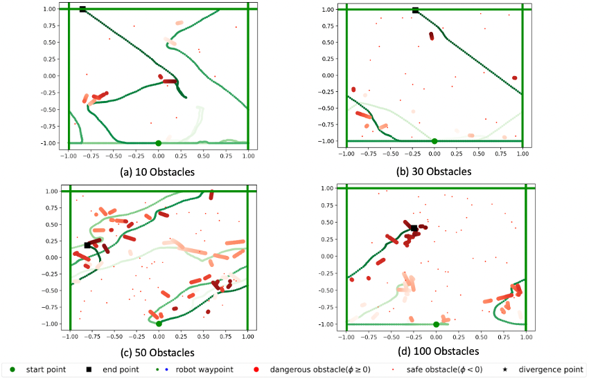

# Model-Free-Safe-Control-for-Reinforcement-Learning-in-a-Clustered-Dynamic-Environment

## Table of Contents
- [Introduction](#Introduction)
- [Install](#install)
- [Usage](#usage)
- [Acknowledgments](#Acknowledgments)

## Introduction
We provide code for evaluate effectiveness of safety shield algorithm of the basic RL framework under different testing environments.

For safety comparison, we use four safety shield algorithms:
1, pure-AdamBA (Black-box method)
2, modified-AdamBA (Black-box method)
3, pure SSA (White-box method)
4, adative SSA (White-box method)

For testing effectiveness of safety shield, we test the algorithms in different testing environments:
1, different number of obstacles 
2, different sampling resolutions for AdamBA algorithm

For efficiency results of the safety shield algorithm incorporating with the basic RL algorihtms, we inherited the exploration strategies from Hongyi's paper:
1, Adapting SSA;  
2, Exploration (PSN, RND, None);  
3, Learning from SSA;  


The safety and efficient results of all models are shown below





We also provide visulization of sample trajectories for two main algorithms.




## Install

```
conda create -n safe-rl
conda install python=3.7.13
pip install tensorflow==2.0.0
pip install future
pip install keras
pip install matplotlib
pip install gym
pip install cvxopt
```

## Usage

```
python src/train.py --display {none, turtle} --explore {none, psn, rnd} --no-qp --ssa-buffer --ISSA --no-pureAdamBA --obs_num {20, 50, 100} --AdamBA_resol {50, 100, 300}
python src/train.py --display {none, turtle} --explore {none, psn, rnd} --no-qp --ssa-buffer --ISSA --pureAdamBA --obs_num {20, 50, 100} --AdamBA_resol {50, 100, 300}
python src/train.py --display {none, turtle} --explore {none, psn, rnd} --qp --ssa-buffer --np-ISSA --no-pureAdamBA --obs_num {20, 50, 100} --AdamBA_resol {50, 100, 300}

For quick sample run, use the following commend:
python src/train.py --display turtle --explore rnd --no-qp --ssa-buffer --ISSA --no-pureAdamBA --obs_num 50 --AdamBA_resol 100

```

- `--display` can be either `none` or `turtle` (visulization).
- `--explore` specifies the exploration strategy that the robot uses. 
- `--no-qp` means that we use vanilla SSA.
- `--qp` means that we use adapted SSA.
- `--no-ssa-buffer` means that we use the default learning.
- `--ssa-buffer` means that we use the safe learning from SSA demonstrations.
- `--ISSA` means that we use black-box method to find safe control. 
- `--no-ISSA` means that we use white-box qp algorithm to find safe control, or doesn't have safety shield at all. 
- `--pureAdamBA` means that we use the pure AdamBA.
- `--no-pureAdamBA` means that we use the modified AdamBA.
- `--obs_num` means the number of obstacles in the environment, which can be '20', '50', or '100'.
- `--AdamBA_resol` means the resolution of the AdamBA algorithm, which can be '50', '100', or '300'.


## Acknowledgments
Part of the simulation environment code is coming from the course CS 7638: Artificial Intelligence for Robotics in GaTech. We get the permission from the lecturor Jay Summet to use this code for research. The pure AdamBA algorithm and part of the related code is coming from the paper: Model-free Safe Control for Zero-Violation Reinforcement Learning. Part of the Reinforcement-Learning related code is coming from the paper: Safe and Sample-Efficient Reinforcement Learning for Clustered Dynamic Environments. We get the permission from the corresponding authors to use this code to do more research in the related topic.
